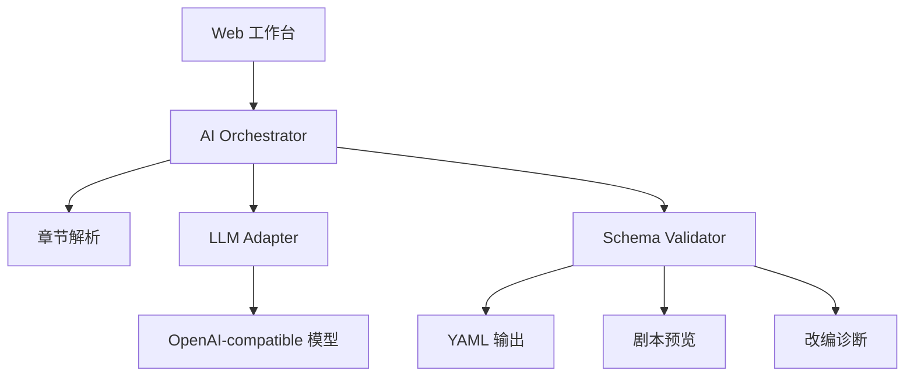

# XEngineer Dramatize

一个把小说章节改成剧本初稿的 AI 工具。作者粘贴小说，填入兼容 OpenAI 的模型配置，就能得到一份结构化 YAML 剧本：有角色表、幕结构、场景、动作、对白和改编说明。

项目为七牛云 XEngineer 72 小时作品挑战开发，重点展示三件事：真实 AI 改编能力、可继续编辑的剧本结构、清晰可测试的工程实现。

## 功能亮点

- **真实 AI 改编**：通过 OpenAI-compatible Chat Completions API 调用模型，不把规则格式化伪装成 AI。
- **多章节处理**：可以粘贴单章试用，也能处理 3 章以上小说文本。
- **YAML 剧本初稿**：输出角色、幕、场景、动作、对白、潜台词和转场，方便作者继续打磨。
- **改编诊断**：展示章节数、字数、处理批次、AI/Fallback 模式和校验信息。
- **可测转换核心**：章节解析、模型适配、Schema 校验、YAML 序列化都独立于 UI。

## 作品效果

页面左侧是小说和模型配置，右侧是生成结果。点击生成后：

1. AI 读取章节并按剧本 Schema 输出 YAML。
2. 工具校验结构是否完整。
3. 作者可以在 YAML、剧本预览、改编诊断三个视图之间切换。
4. 结果可以复制，也可以下载为 `.yaml` 文件。

内置两个演示文本：悬疑短篇“雨夜戏院”，以及“麦田里的守望者（原创示例）”。第二个示例只用于展示青春成长题材的转换效果，不包含原著文本。

## 运行

```bash
npm install
npm run dev
```

打开终端输出的本地地址，通常是 `http://127.0.0.1:5173/`。

## 模型配置

使用 OpenAI-compatible provider：

- API Base URL: `https://api.openai.com/v1`
- API Key: 模型服务商提供的 API key
- Model: 模型名，例如 `gpt-4o-mini`

如果未配置 API Key，工具会生成明确标注的 fallback YAML，方便查看结构和演示错误保护。正式 AI 改编需要填写可用模型配置。

## 测试与构建

```bash
npm test
npm run build
```

## YAML Schema

见 [docs/yaml-schema.md](docs/yaml-schema.md)。

## 架构


