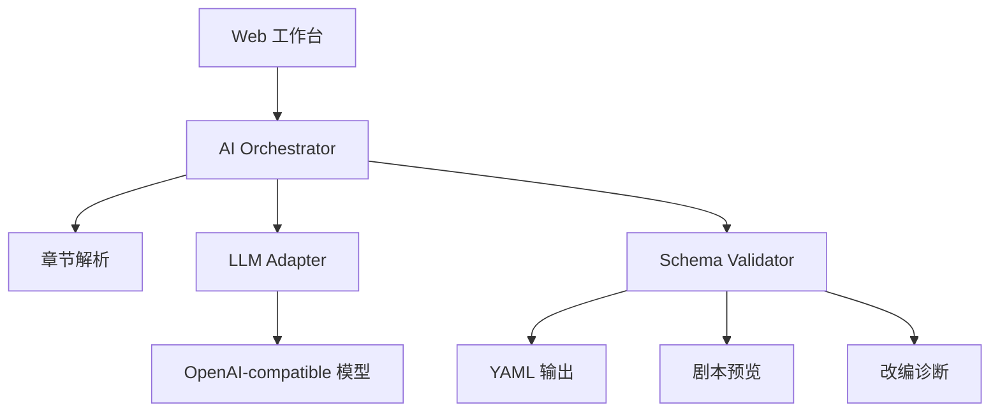

# XEngineer Dramatize

AI 小说转剧本工具，面向七牛云 XEngineer 72 小时作品挑战。用户粘贴一个或多个小说章节，配置 OpenAI-compatible 模型服务后，工具生成结构化 YAML 剧本初稿，并提供剧本预览、改编诊断、复制和下载。

## 功能亮点

- 真实 AI 改编：通过 OpenAI-compatible Chat Completions API 调用模型。
- 支持 3 章以上：章节解析器可处理多章节输入，也允许单章节试用。
- 可编辑 YAML：输出遵循项目定义的剧本 Schema。
- 改编诊断：展示章节数量、字数、调用批次、AI/Fallback 模式和校验信息。
- 工程可测：转换核心与 UI 分离，并提供自动化测试。

## 运行

```bash
npm install
npm run dev
```

打开终端输出的本地地址，通常是 `http://127.0.0.1:5173/`。

## 模型配置

使用 OpenAI-compatible provider：

- API Base URL: `https://api.openai.com/v1`
- API Key: 模型服务商提供的 API key
- Model: 模型名，例如 `gpt-4o-mini`

如果未配置 API Key，工具会生成明确标注的 fallback YAML，方便查看结构和演示错误保护；正式 AI 改编需要填写可用模型配置。

## 测试与构建

```bash
npm test
npm run build
```

## YAML Schema

见 [docs/yaml-schema.md](docs/yaml-schema.md)。

## 架构


