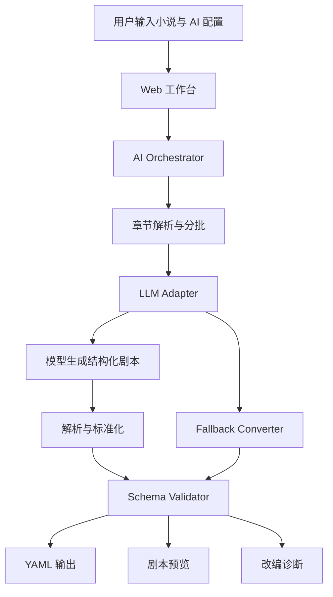

# AI 小说转剧本工具设计规格

## 背景

七牛云 XEngineer 第三批次 72 小时作品挑战的题目要求开发一款 AI 辅助剧本创作工具，帮助小说作者降低作品改编成剧本的门槛。作品需要能够把小说文本自动转换为结构化剧本 YAML，让作者快速获得可编辑、可继续打磨的剧本初稿，并额外提供 YAML Schema 文档说明结构设计原因。

本项目面向比赛交付，目标是均衡体现产品完整度、工程质量和创新性。系统必须能演示真实 AI 改编能力，同时保持代码结构清晰、可测试、可解释。

## 目标

构建一个 Web + 可测试转换核心的 AI-first 剧本改编工具。用户输入一个或多个小说章节，配置 OpenAI-compatible 模型服务后，系统调用真实 AI 完成章节理解、人物抽取、场景拆分、对白改写和 YAML 剧本生成，并提供剧本预览、改编诊断、复制和下载能力。

系统需要具备处理 3 个章节以上小说文本的能力，但不强制用户每次输入至少 3 章。单章节输入应作为试用场景正常工作。

## 非目标

- 不做账号系统、登录注册或权限管理。
- 不做云端存储、历史版本管理或多人协作。
- 不做复杂富文本剧本编辑器。
- 不把本地规则转换器作为主要卖点。
- 不绑定单一模型厂商；默认适配 OpenAI-compatible API。

## 用户流程

1. 用户打开 Web 应用。
2. 用户填写 `API Base URL`、`API Key` 和 `Model`。
3. 用户粘贴小说文本。文本可以包含一个或多个章节；系统自动识别章节标题。如果没有章节标题，则当作单章节处理。
4. 系统显示章节数、字数和预计处理批次，并提示工具支持 3 章以上文本的自动转换。
5. 用户点击生成。
6. AI 改编管线按章节或批次分析小说，生成统一的结构化剧本对象。
7. Schema 校验器检查剧本对象是否包含核心字段、章节来源和场景结构。
8. 页面展示 YAML 原文、剧本预览和改编诊断。
9. 用户复制 YAML 或下载 `.yaml` 文件。

## 架构

系统分为五个主要模块：

### Web 工作台

Web 工作台负责比赛演示和作者操作体验。它包含 AI 配置区、小说输入区、生成状态、YAML 输出、剧本预览、改编诊断、复制和下载按钮。

工作台不直接拼接 AI 提示词，也不直接构造 YAML。它只负责收集输入、调用转换核心、展示转换结果和错误状态。

### AI Orchestrator

AI Orchestrator 是核心改编管线，负责把小说文本转成结构化剧本。它按以下步骤工作：

1. 解析输入文本，得到章节列表。
2. 根据章节数量和长度创建处理批次。
3. 调用 LLM Adapter 请求模型完成改编。
4. 解析模型返回的 YAML 或 JSON 结构。
5. 将结果标准化成内部剧本对象。
6. 调用 Schema Validator 校验结果。
7. 返回剧本对象、YAML 字符串和改编诊断。

### LLM Adapter

LLM Adapter 封装 OpenAI-compatible API 调用。它接收 `baseUrl`、`apiKey`、`model`、`messages` 和生成参数，发送请求并返回模型文本。

默认接口使用 Chat Completions 风格，以便接入 OpenAI、七牛云兼容模型服务或其他兼容供应商。Adapter 负责处理 HTTP 错误、鉴权失败、超时和模型返回为空等情况。

### Schema Validator

Schema Validator 对 AI 输出做结构约束。它检查顶层字段、章节来源、角色列表、幕结构、场景、对白和改编说明。校验失败时，系统应显示可读错误；如果模型返回了可解析的部分内容，则尽量保留原始响应供用户排查。

### Fallback Converter

Fallback Converter 仅作为失败保护。当 API 配置缺失、网络失败或模型输出不可解析时，它可以生成基础结构，帮助用户理解期望输出形态。界面必须清楚标识这是 fallback 结果，不把它包装成真实 AI 改编。

## 数据流

## AI 提示词策略

模型提示词需要明确四件事：

1. 输入是小说文本，输出是剧本初稿，不是摘要。
2. 输出必须遵循项目定义的 YAML Schema。
3. 改编时要保留章节来源，方便作者追溯。
4. 每个场景需要包含地点、时间、人物、冲突、动作、对白和转场建议。

提示词应要求模型避免输出 Markdown 代码围栏之外的解释性文本。如果模型仍返回代码围栏，解析器需要能剥离围栏并提取 YAML。

## YAML Schema 方向

最终 YAML 顶层包含以下字段：

- `metadata`：作品名、语言、剧本格式、生成时间、模型信息。
- `source`：原小说章节、章节摘要和覆盖范围。
- `characters`：角色名、身份、性格、目标、关系、出场章节。
- `acts`：幕结构，每幕包含主题、叙事功能和场景编号。
- `scenes`：场景编号、来源章节、地点、时间、人物、情节目标、冲突、动作、对白、转场。
- `adaptation_notes`：AI 的改编取舍、合并说明和人工润色建议。
- `validation`：章节覆盖、字段完整度和校验结果。

这个结构把剧本初稿设计成可编辑资产，而不是一次性纯文本。作者可以按角色、场景、对白和章节来源分别修改，也能理解 AI 为什么做出某些改编取舍。

## 错误处理

- API 配置缺失：生成前提示用户填写缺失字段。
- 网络失败：显示 HTTP 状态或网络错误，并允许重试。
- 模型超时：显示超时提示，建议减少输入或更换模型。
- 返回非 YAML：尝试剥离 Markdown 代码围栏并重新解析；仍失败则显示原始响应。
- 字段缺失：展示 Schema 校验错误，保留可解析内容。
- 无章节标题：按单章节处理。
- 长文本：按章节分批，避免一次请求过长。

## 测试策略

测试覆盖以下行为：

- 章节解析支持单章节、多章节、3 章以上和无标题文本。
- LLM Adapter 能构造 OpenAI-compatible 请求，并能处理成功、鉴权失败和网络错误。
- AI Orchestrator 能把模型响应解析成剧本对象。
- YAML 序列化能输出稳定、可复制、可下载的结构。
- Schema Validator 能发现缺失核心字段的输出。
- Web 工作台能完成输入、生成、展示错误和展示成功结果的主要流程。

## 交付物

- 一个可运行 Web 应用。
- 一个独立、可测试的 AI 改编核心模块。
- 一个 OpenAI-compatible LLM Adapter。
- 一个 YAML Schema 文档：`docs/yaml-schema.md`。
- README，说明安装、运行、模型配置、演示流程和项目亮点。
- 自动化测试，用于支撑工程质量评分。
